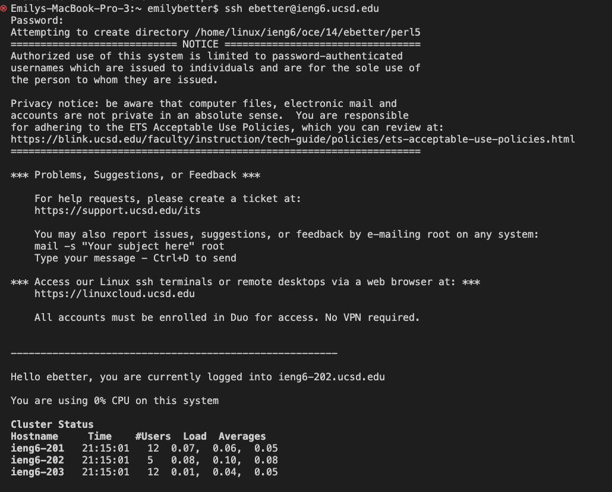

# Lab Report 1

###### Part 1- Installing Visual Studio Code

Go to the Visual Studio Code website. Click on the corresponding link  to download VSC onto your computer.
[VCS](https://code.visualstudio.com/download)

Once you download and open VSC, it should look something like this.


###### Part 2- Remotely Connecting
Start by finding your course specific account. Go to the [Account Lookup](https://sdacs.ucsd.edu/~icc/index.php) page and fill out your information. You should then see a page like this.


I was on a Mac computer, so I did not need to install OpenSSH. Start by opening a terminal in VSCode. In the terminal, your first command will be `$ ssh cs15lfa22zz@ieng6.ucsd.edu`
Replace "zz" with the letters in your course specific account. I was unable to login with the course specific account, after trying multiple times to reset my password and login. I used my SSO login instead. If it's your first time loggin in remotely, it should look something like this:


###### Part 3- Trying Some Commands
Try some commands in both your computer and the remote computer. Terminal --> Split Terminal allows you to have two terminals side by side. I logged into ssh on one, and compared the commands on each side by side.
My computer:
I printed the working directory (pwd), listed (ls), changed directory to home (cd ~) and then listed again.

Remote login:
On the remote, I used the same commands to see how they worked differently than on my home computer. I printed the working directory, listed, changed directory to home, and then listed again.


###### Part 4- Moving Files with scp
Create a text file on VCS called "WhereAmI.java" with the contents:
```
class WhereAmI {
  public static void main(String[] args) {
    System.out.println(System.getProperty("os.name"));
    System.out.println(System.getProperty("user.name"));
    System.out.println(System.getProperty("user.home"));
    System.out.println(System.getProperty("user.dir"));
  }
}
```
Run the following commands to compile and run the class
```
javac WhereAmI.java
java WhereAmI
```
Then copy the file to the remote server with this command, replacing 'cs15lfa22zz' with your course specific account:
`scp WhereAmI.java cs15lfa22zz@ieng6.ucsd.edu:~/`


###### Part 5- Setting an SSH Key
In terminal, type the command: `ssh-keygen`
When given the prompt `Enter file in which to save the key:` press `enter` again to specify the default path 


Then use these commands to copy the public key to the .ssh directory onto your account on the server.
```
# on client
$ ssh ebetter@ieng6.ucsd.edu
<Enter Password>
```
```
# now on server
$ mkdir .ssh
$ <logout>
```
```
# back on client
$ scp /Users/emilybetter/.ssh/id_rsa.pub ebetter@ieng6.ucsd.edu:~/.ssh/authorized_keys
# You use your username and the path you saw in the command above
```


###### Part 6- Optimizing Remote Running

I used the hints given to optimize remote running. I ran the command `scp WhereAmI.java ebetter@ieng6.ucsd.edu:~/ ; javac WhereAmI.java; java WhereAmI'
After making a local change, I pressed the up arrow key to recall the last command. 

