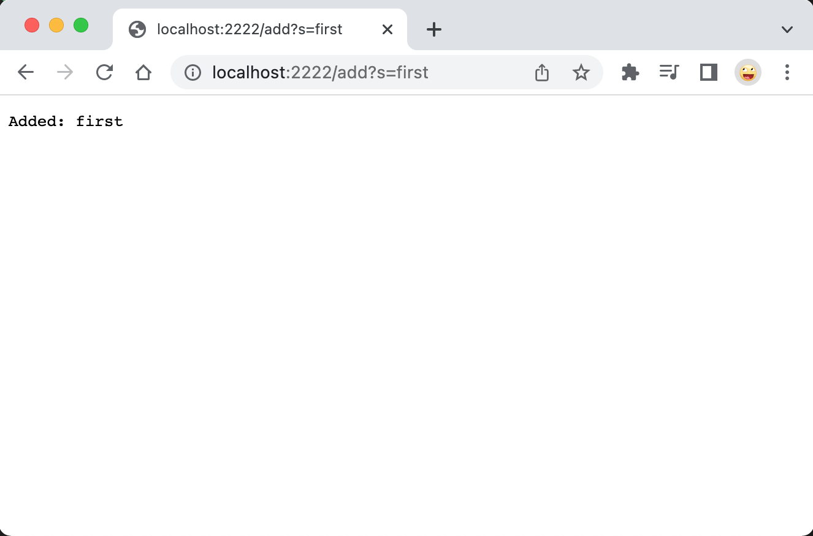
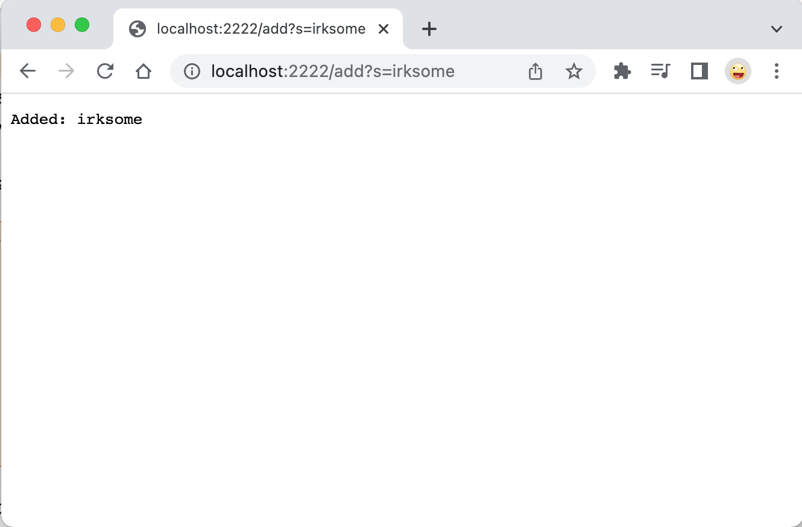
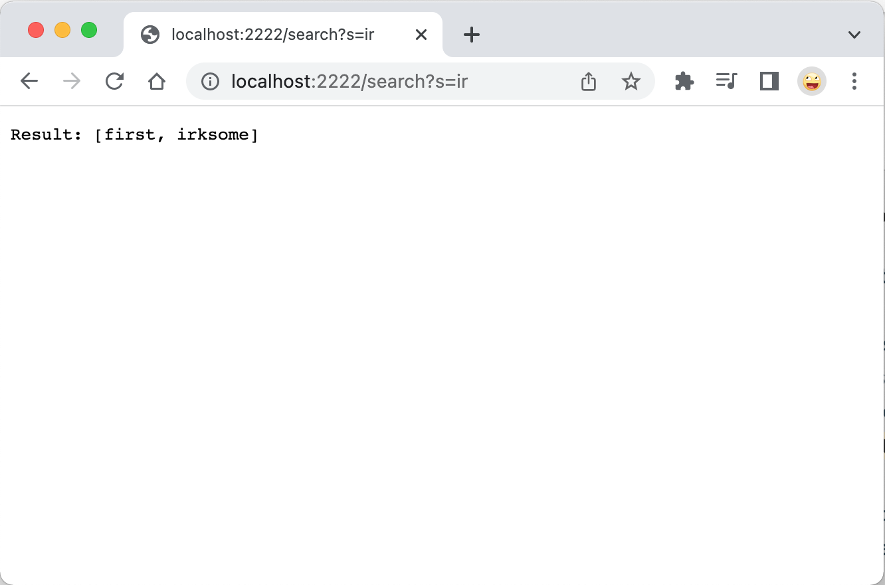
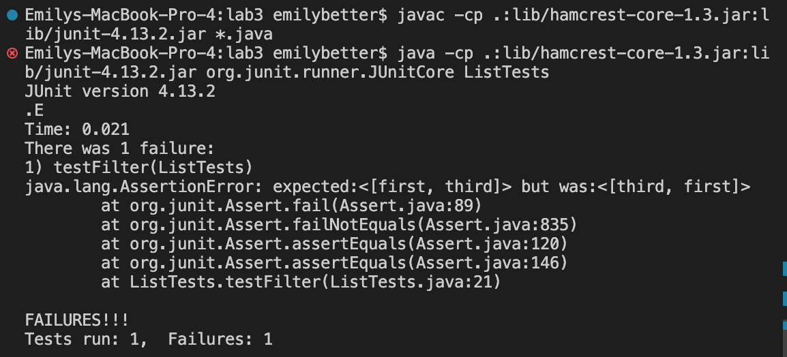
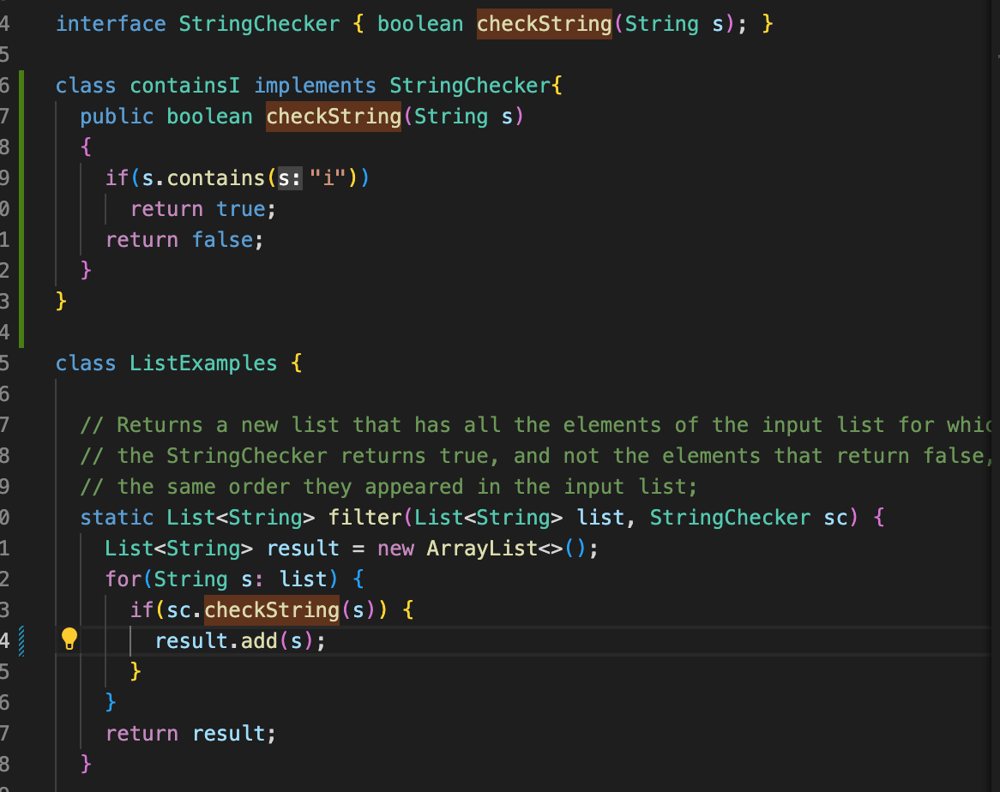

#Lab Report 2

## Part 1- Simplest Search Engine
The code for my Simplest Search Engine:
```
import java.io.IOException;
import java.net.URI;
import java.util.ArrayList;

class Handler implements URLHandler {
    // The one bit of state on the server: a number that will be manipulated by
    // various requests.
    int num = 0;
    ArrayList<String> listStrings = new ArrayList<String>();

    public String handleRequest(URI url) {
        if (url.getPath().equals("/")) {
            return String.format("Number: %d", num);
        } else if (url.getPath().equals("/increment")) {
            num += 1;
            return String.format("Number incremented!");
        } else {
            System.out.println("Path: " + url.getPath());
            if (url.getPath().contains("/add")) {
                String[] parameters = url.getQuery().split("=");
                if (parameters[0].equals("count")) {
                    num += Integer.parseInt(parameters[1]);
                    return String.format("Number increased by %s! It's now %d", parameters[1], num);
                }
                if (parameters[0].equals("s")) {
                    listStrings.add(parameters[1]);
                    return "Added: "+parameters[1];
                }
            }
            else if (url.getPath().contains("/search")){
                ArrayList<String> searchListStrings = new ArrayList<String>();
                String[] parameters = url.getQuery().split("=");
                if (parameters[0].equals("s")) {
                    for (String s : listStrings){
                        if (s.contains(parameters[1])){
                            searchListStrings.add(s);
                        }
                    }
                    return "Result: " + searchListStrings;
                }
            }
            return "404 Not Found!";
        }
    }
}
```
In this screenshot I am calling the handleRequest method. First the method checks if there is a path after '/'. 
There is, so the value of url.gethPath() is going to be /add and the value of url.getPath().contains("/add") is true. 
Then, url.getQuery() is ?s=first. It splits this String from the =, and parameters[0] is going to store the first string (s), 
so parameters[0].equals("s") is true and parameters[1] (in this case, 'first') is added to the list of Strings. These values stay the same until I make a new request.

In this screenshot I am calling the handleRequest method. First the method checks if there is a path after '/'. 
There is, so the value of url.gethPath() is going to be /add and the value of url.getPath().contains("/add") is true. 
Then, url.getQuery() is ?s=first. It splits this String from the =, and parameters[0] is going to store the first string (s), 
so parameters[0].equals("s") is true and parameters[1] (in this case, 'second') is added to the list of Strings. These values stay the same until I make a new request.

In this screenshot I am calling the handleRequest method. First the method checks if there is a path after '/'. 
There is, so the value of url.gethPath() is going to be /add and the value of url.getPath().contains("/add") is true. 
Then, url.getQuery() is ?s=irksome. It splits this String from the =, and parameters[0] is going to store the first string (s), 
so parameters[0].equals("s") is true and parameters[1] (in this case, 'irksome') is added to the list of Strings. These values stay the same until I make a new request.

In this screenshot, I am calling the handleRequest method. The values of url.getPath() is /search and url.getPath().contains("/search") is true. Then, url.getQuery() is ?s=ir. It splits the string at the =, and so parameters[0] is s and parameters[1] is ir. It searches the stored list of strings, and in this case returns first and irksome because they both contain "ir." These values stay the same until I make a new request.



## Part 2- Bugs
###### Bug 1: Reversed()
The failure-inducing input:
```
@Test
  public void testReversed2() {
    int[] input1 = {1,2,3};
    assertArrayEquals(new int[]{3,2,1}, ArrayExamples.reversed(input1));
  }
```
The symptom: `arrays first differed at element [0]; expected:<3> but was:<0> `
<br />The bug: <br />
The original code: 
```
static int[] reversed(int[] arr) {
    int[] newArray = new int[arr.length];
    for(int i = 0; i < arr.length; i += 1) {
      arr[i] = newArray[arr.length - i - 1];
    }
    return arr;
  }
```
 The fixed code:
```
 static int[] reversed(int[] arr) {
    int[] newArray = new int[arr.length];
    for(int i = 0; i < arr.length; i += 1) {
      newArray[i] = arr[arr.length - i - 1];
    }
    return newArray;
  }
 ```
The function is assigning the value of the original array to the value of the new, empty array, so each element is zero (the function would return an array with all elements = 0). This is why we get the error that expected is 3 but actual is 0. Also, the method returns the original array instead of the new one.

###### Bug 2: filter()
The failure-inducing input:
```
@Test
    public void testFilter() {
        ArrayList<String> actual = new ArrayList<String>();
        ArrayList<String> expected = new ArrayList<String>();

        actual.add("first");
        actual.add("second");
        actual.add("third");

        expected.add("first");
        expected.add("third");

        StringChecker sc = new containsI();
        assertEquals(expected, ListExamples.filter(actual, sc));
}
 
 
The symptom: 
The bug: <br />
The original code: 
```static List<String> filter(List<String> list, StringChecker sc) {
    List<String> result = new ArrayList<>();
    for(String s: list) {
      if(sc.checkString(s)) {
        result.add(0, s);
      }
    }
    return result;
  }
 ```
 The fixed code:

The function is returning a new list that has all the elements of the input list for which the StringChecker returns true, and not the elements that return false, in the same order they appeared in the input list. But instead of appending the Strings to the list(to keep the same order they appeared in the input list), `add(0,s)` prepends the element instead. This is why we get [third, first] instead of the expected [first, third].

  


