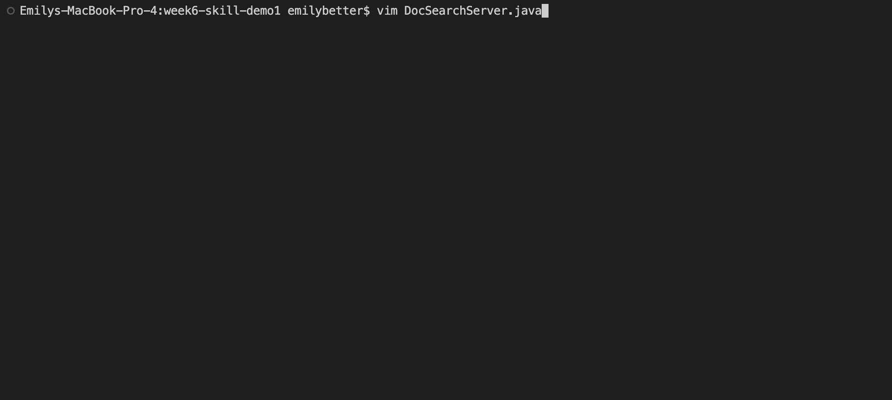
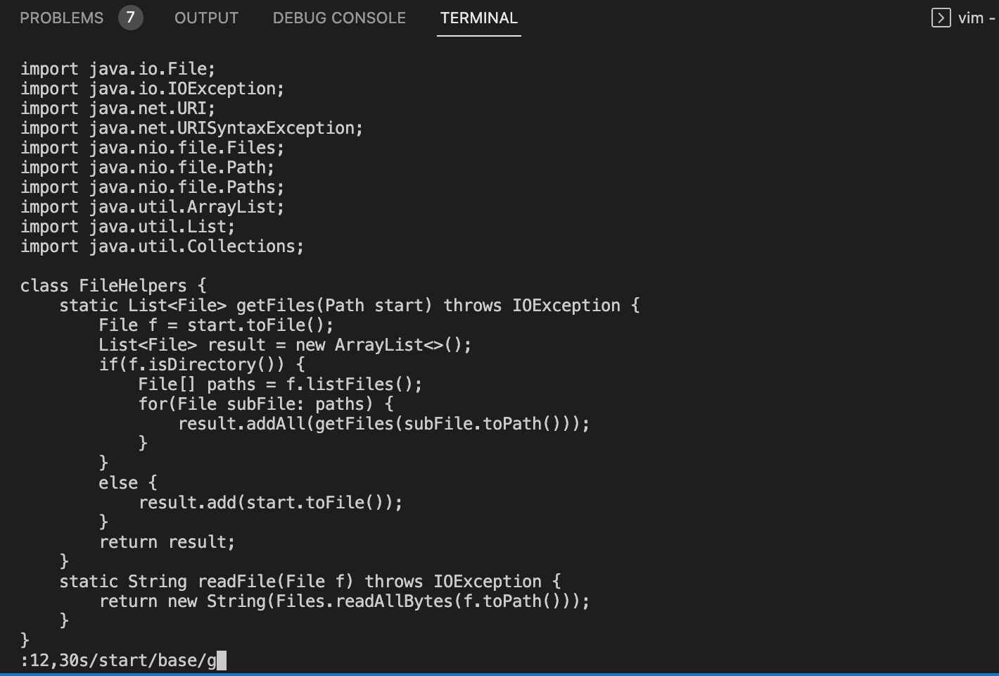
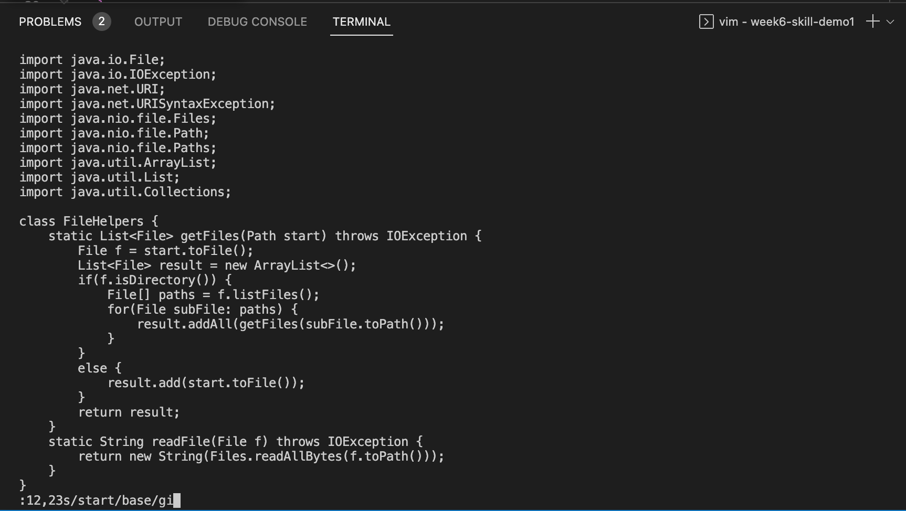

# Lab Report 4
### Part 1
In DocSearchServer.java, change the name of the start parameter of getFiles, and all of its uses, to instead be called base.

The shortest sequence of vim commands that we came up with for this task was:  
`:` `1` `2` `,` `2` `3` `s` `/` `s` `t` `a` `r` `t` `/` `b` `a` `s` `e` `/` `g` `<Enter>`
This is a total of 21 keys pressed. 
`:s/searchString/replaceString/g` replaces a string across the whole file (g means global).     
`[a,b]` replaces between lines a and b 
So, ':12,23s/start/base/g` replaces the string start with base from line 12 to line 23.   

Vim into DocSearch.java:

Typing command:

After replacing:

### Part 2

