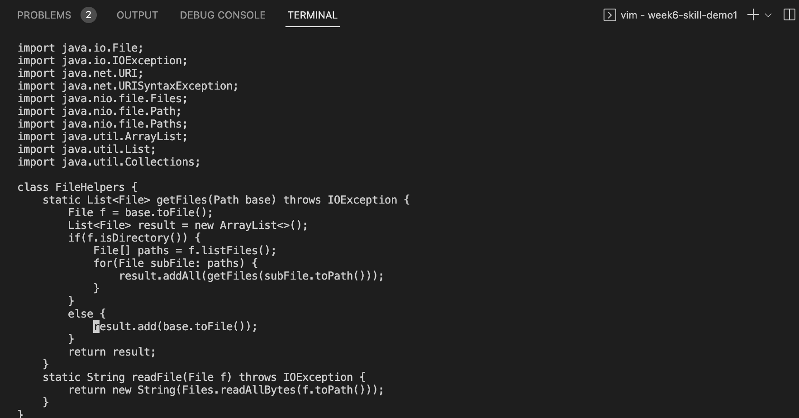

# Lab Report 4
### Part 1
In DocSearchServer.java, change the name of the start parameter of getFiles, and all of its uses, to instead be called base.

The shortest sequence of vim commands that we came up with for this task was:  
`:` `1` `2` `,` `2` `3` `s` `/` `s` `t` `a` `r` `t` `/` `b` `a` `s` `e` `/` `g` `<Enter>`  
This is a total of 21 keys pressed. 
`:s/searchString/replaceString/g` replaces a string across the whole file (g means global).     
`[a,b]` replaces between lines a and b 
So, ':12,23s/start/base/g` replaces the string start with base from line 12 to line 23.   

Vim into DocSearch.java:

Typing command:

After replacing:

### Part 2
Consider performing the edit task you chose and re-running the program when you have to run it remotely. Time yourself twice:
Starting in VSC and making the edit, then scp'ing the file and running it on the remote server took about 45 seconds for me to do.
Starting logged into ssh, then making the edit in vim and running the test took about 20 seconds for me to do.

If I had to work on a program that I was running remotely, I would prefer to use vim. I think it is a lot more work (and time) to get a copy on your local computer, change something, scp the change to the remote, and then run it to make sure it works. Especially if it is a small edit, it is faster to do it with vim.   
If I was making a file/class completely from scratch, I might prefer to write it locally (as I am more used to this) and then scp, but if it just editing a pre existing program I would choose vim.
