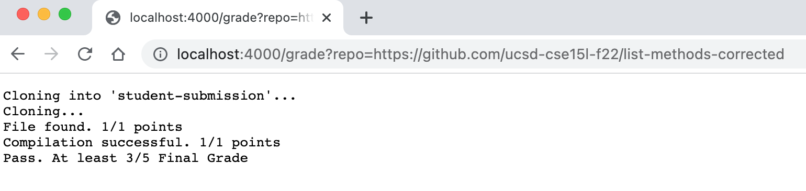
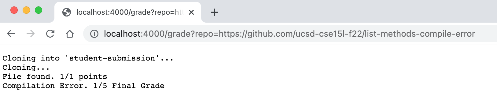
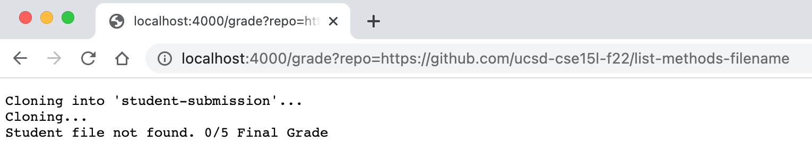

# Lab Report 5

My `grade.sh` code: 

```
# Create your grading script here
rm -rf student-submission
git clone $1 student-submission

echo "Cloning..."

cd student-submission

if [ -f ListExamples.java ]
then
    echo "File found. 1/1 points"
else
    echo "File not found. 0/5 Final Grade"
    exit
fi

cp ListExamples.java ..

cd ..

javac -cp .:lib/hamcrest-core-1.3.jar:lib/junit-4.13.2.jar *.java 2> err.txt

if [ $? -ne 0 ]
then
    echo "Compilation Error. 1/5 Final Grade"
    exit
else
    echo "Compilation successful. 1/1 points"
fi

java -cp .:lib/hamcrest-core-1.3.jar:lib/junit-4.13.2.jar org.junit.runner.JUnitCore TestListExamples > grade.txt

PASSED=$(grep -c OK grade.txt)

if [ $PASSED -eq 1 ]
then
    echo "Pass. At least 3/5 Final Grade"
else
    echo "Fail. Less than 3/5 Final Grade"
fi

exit
```

The output for three different student repositories: <br />
[Repository 1:](https://github.com/ucsd-cse15l-f22/list-methods-corrected)


[Repository 2:](https://github.com/ucsd-cse15l-f22/list-methods-compile-error)


[Repository 3:](https://github.com/ucsd-cse15l-f22/list-methods-filename)



### Trace of grade.sh
The trace of grade.sh on the [student repository](https://github.com/ucsd-cse15l-f22/list-methods-filename) with the wrong file name. <br />
On line number 2, the command `rm -rf` has no standard output, no error output, and an exit code of 0. <br />
On line number 3, the command `git clone` has a standard output of `Cloning into student-submission`, no error output, and an exit code of 0.<br />
On line number 5, the command `echo` has a standard output of `Cloning...`, no error output, and an exit code of 0.<br />
On line number 7, the command `cd` has no standard output, no error output, and an exit code of 0.<br />
On line number 9, the command `if` has no standard output, no error output, and an exit code of 1. The condition is false because the file name is incorrect.<br />
Lines 10 and 11 do not run because it is in an if branch that doesn't evaluate.<br />
On line number 12, the command `else` has no standard output, no error output, and an exit code of 0.<br />
On line number 13, the command 'echo' has a standard output of `File not found. 0/5 Final Grade`, no error output, and an exit code of 0.<br />
On line number 14, the command `exit` has no standard output, no error output, and an exit code of 1.<br />
The rest of the lines in the file do not run because of the early exit.<br />
